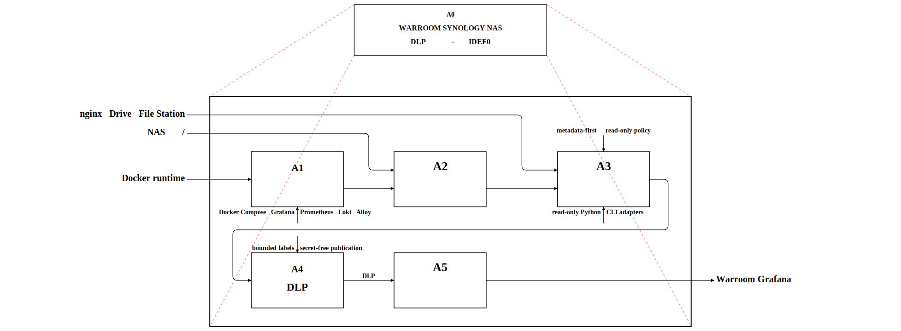
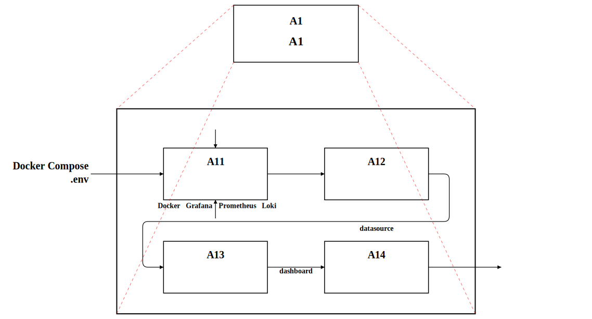
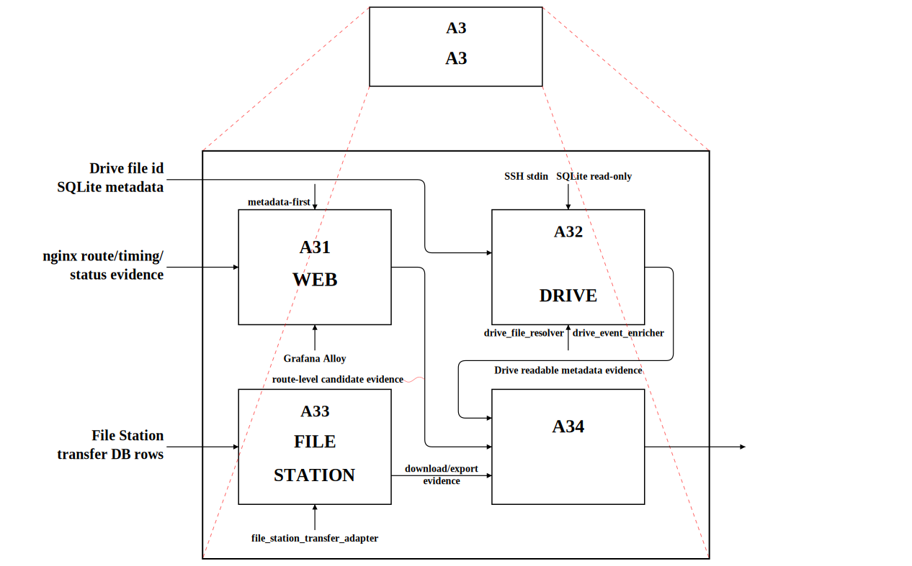
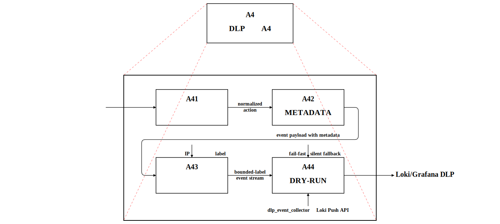
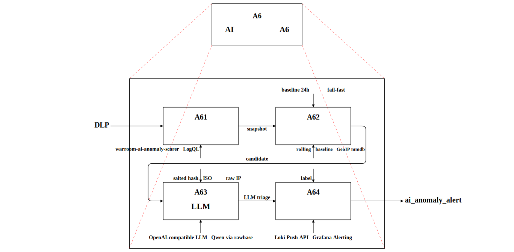
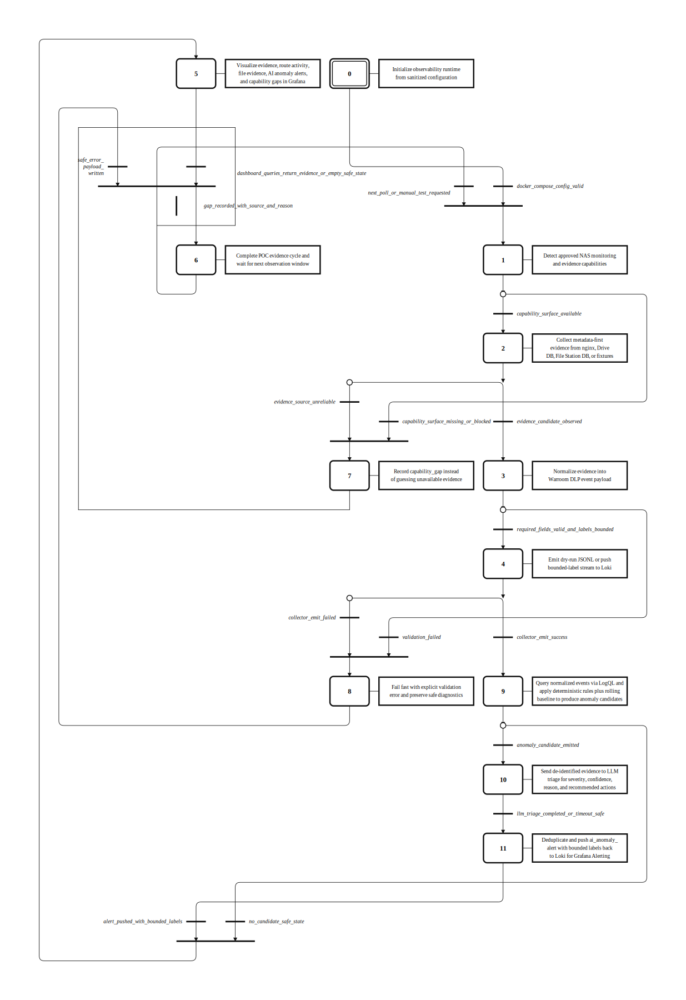

# Warroom：Synology NAS DLP 監控概念驗證

Warroom 是一個企業內部監控與稽核平台概念驗證。本專案目前聚焦在 **Synology NAS 檔案外流偵測（DLP）**：觀察使用者透過 Synology Drive、File Station、分享連結與 nginx web ingress 存取檔案的行為，將證據正規化後送進 Grafana/Loki/Prometheus 進行檢視。

> 公開版說明：此 repository 已移除真實 NAS 登入資訊、私人網域、email、金鑰、cookie、session token 與原始敏感 log。所有主機、帳號、路徑與事件資料皆應以你自己的環境設定取代。

## 目標

- 建立 Docker Compose 版觀測平面：Grafana、Prometheus、Loki、Alloy 與 DLP metadata collector。
- 以 metadata-first 方式蒐集 DLP 證據，不讀取檔案內容。
- 將 Synology nginx、Drive DB、File Station transfer DB 的資料轉換成一致的 DLP event JSON。
- 在 Grafana 中查看 web ingress、檔案證據、事件串流與能力缺口。
- 對不能可靠觀察的行為輸出 capability gap，而不是用猜測補齊。

## 系統架構圖

以下圖表由 `miatdiagram` 產生 drawmiat-compatible IDEF0 JSON，再由 drawmiat renderer 輸出新版 SVG。

### A0：Warroom Synology NAS DLP 概念驗證



### A1：部署可觀測性平面



### A3：蒐集防禦證據



### A4：正規化 DLP 事件



### A6：AI 異常分析與分流

正規化事件除了進視覺化（A5），也分流給 AI 異常分析（A6）。A6 是兩段式管線：先用確定性規則與 rolling baseline 從事件產生 candidate，再把去識別化證據送 LLM 做 triage 分級與建議，最後把 `ai_anomaly_alert` 推回 Loki 供告警與儀表板使用。



### GRAFCET：端到端狀態流

下圖以 GRAFCET（IEC 60848）描述從初始化、能力偵測、證據蒐集、正規化、AI 異常分析到視覺化的完整狀態流；step 9–11 即 A6 的規則偵測、LLM triage 與告警推送。



## 核心元件

| 元件 | 位置 | 用途 |
| --- | --- | --- |
| Grafana | `docker-compose.yml`, `grafana/` | 儀表板與證據視覺化 |
| Prometheus | `prometheus/` | metrics 與 exporter health |
| Loki | `loki/` | DLP event 與 web ingress log 儲存 |
| Alloy nginx log exporter | `loki/synology-nginx-alloy.template.alloy` | 接收或 tail Synology nginx log |
| DLP file collector | `services/warroom-dlp-file-collector/` | 依 `config/nas-targets.json` 週期性蒐集 NAS metadata evidence，失敗時輸出 capability gap |
| Drive resolver | `tools/drive_file_resolver.py` | 唯讀解析 Synology Drive `file_id` / `permanent_id` 到可讀 metadata |
| Drive enricher | `tools/drive_event_enricher.py` | 透過 SSH stdin 執行 resolver，產生 Drive DLP event |
| File Station adapter | `tools/file_station_transfer_adapter.py` | 唯讀讀取 File Station transfer DB，產生 download/export event |
| DLP event collector | `tools/dlp_event_collector.py` | 驗證 normalized event，dry-run 或推送到 Loki |
| AI anomaly scorer | `services/warroom-ai-anomaly-scorer/` | 每 60s 以 LogQL 查 Loki，跑確定性規則 + rolling baseline 產生 candidate，再送 LLM triage，把 `ai_anomaly_alert` 推回 Loki |

## 實作方式

### 1. Web ingress 證據

Synology nginx 是 web app 的入口層。Warroom 用 Alloy 接收 nginx access/syslog，萃取低敏感度 label，例如 route family、HTTP method、status 與 transport。

```text
Synology nginx access/syslog
  -> Grafana Alloy
  -> Loki
  -> Grafana web ingress dashboard
```

nginx 能證明使用者進入了 Drive/File/Sharing 等路由，也能提供 timing 與 status；但 browser fragment（例如 `#file_id=...`）不會送到伺服器，所以 nginx 不能單獨回答「是哪一個檔案」。

### 2. Synology Drive 檔案識別

Drive 事件需要 DB enrichment：先用 Drive 的 routing DB 將 `file_id` / `permanent_id` 對應到 view，再讀 view DB 的 node metadata 重建可讀檔案資訊。

```text
Drive file_id / permanent_id
  -> view-route-db.sqlite route_table
  -> view/<id>/view-db.sqlite node_table
  -> file_name / folder_path / display_path
  -> normalized DLP event
```

`tools/drive_event_enricher.py` 採用最小侵入模式：本機把 resolver script 透過 SSH stdin 傳到 NAS，NAS 端用 `sudo -n python3 -` 執行，SQLite 以 read-only mode 開啟，不安裝常駐 agent。

### 3. File Station 下載/匯出證據

File Station 的 transfer DB 可作為 download/export 的高信心證據來源：

```text
File Station transfer DB
  -> tools/file_station_transfer_adapter.py
  -> normalized webapp_file_download / webapp_file_export event
  -> tools/dlp_event_collector.py
  -> Loki / Grafana
```

目前設計把 File Station pure preview/open 視為 capability gap，除非你的環境能證明其他可靠 evidence source。

### 4. 正規化事件

Warroom 使用一致的 DLP event JSON。常見 action 包含：

- `webapp_file_open`
- `webapp_file_preview`
- `webapp_file_download`
- `webapp_file_export`
- `public_share_page_load`
- `sharing_link_access`
- `capability_gap`

Loki labels 僅使用 bounded、低敏感度欄位（例如 `source_app`、`source_channel`、`action`、`nas_host`）。檔名、路徑、使用者與 IP 若需要出現在管理畫面，應留在 event payload，不要放入 label。

### 5. AI 異常偵測

Warroom 的 AI 分析**不是「把原始 log 丟給 LLM 找異常」**，而是兩段式管線：確定性規則先做第一線偵測，LLM 只在第二線做分流（triage）。由 `services/warroom-ai-anomaly-scorer/` 每 60 秒執行一輪。

```text
Loki（正規化 DLP 事件，LogQL 查詢）
  -> [第一段] 確定性規則 + rolling baseline（Python，無 AI）
       產生 candidate（已知什麼可疑、為什麼可疑）
  -> 去重（同 rule + entity 15 分鐘內不重複）
  -> [第二段] LLM triage（OpenAI-compatible，Qwen）
       對成立的 candidate 做分級 / 信心度 / 判斷理由 / 建議動作
  -> push 回 Loki（source_channel=ai_anomaly_alert）
  -> Grafana Alerting + AI 異常告警儀表板
```

**設計重點：LLM 是「分流官」，不是第一線偵測者。** 第一段規則先判定事件是否可疑；第二段才把該 candidate 的去識別化證據送 LLM，請它回答：是否真異常、信心度、判斷理由、建議動作、是否需人工複查。prompt 明確禁止 LLM 發明 root cause、禁止建議破壞性或自動阻斷動作。

#### 分析類型（9 種規則）

**A. 閾值規則**（純 LogQL 聚合 + 門檻）

| rule_id | 偵測什麼 | 嚴重度 |
| --- | --- | --- |
| `AUTH_FAILURE_SPIKE_V1` | 5 分鐘認證失敗 > 20 次（暴力破解） | high |
| `AUTH_SUCCESS_AFTER_FAILURE_V1` | 失敗潮後出現成功登入（破解得手徵兆） | high |
| `NETWORK_CONNECTION_SPIKE_V1` | TCP established > 100（連線異常） | medium |
| `DOWNLOAD_LARGE_FILE_INGESTED_V1` | File Station 下載 ≥ 100MB（外洩） | medium |
| `FILE_DELETE_BURST_V1` | 5 分鐘刪檔 > 20 次（破壞 / 掩蓋） | high |
| `COLLECTOR_ACTIVE_GAP_V1` | 收集器能力缺口（觀測本身失效） | high |

**B. Baseline + GeoIP 規則**（有 24h 學習期）

| rule_id | 偵測什麼 | 嚴重度 |
| --- | --- | --- |
| `IP_ANOMALY_NEW_SOURCE_V1` | 成功登入來自 baseline 沒見過的 IP | medium |
| `IP_ANOMALY_UNEXPECTED_COUNTRY_V1` | 登入解析到非預期 / 黑名單國家 | high |

**C. 快照閾值規則**

| rule_id | 偵測什麼 | 嚴重度 |
| --- | --- | --- |
| `IP_HIGH_FREQUENCY_V1` | 單一遠端 IP 併發連線 > 50 | medium |

#### 隱私與安全特色

- **去識別化優先**：送 LLM 前只給規則摘要 + salted hash + ISO 國碼，**原始 IP 永不外送**，也不進 Loki label。
- **冷啟動抑制**：baseline 有 24h 學習期（`learning` 模式只記錄不告警），避免剛上線就把所有 IP 當異常。
- **Fail-fast 不猜測**：GeoIP 庫缺失時記 `geoip_capability_gap` 指標並回 `unknown`，不亂猜國家。
- **不自動阻斷**：AI 只做分級與建議，實際處置交由人工 / Grafana Alerting，不做破壞性回應。

## 快速開始

### 需求

- Docker + Docker Compose
- Python 3.10+
- `jq`（選用，用於驗證 JSON）
- 若要連接 NAS：可 SSH 到 NAS，且具備讀取對應 Synology DB/log 的授權

### 1. 設定環境變數

```bash
cp .env.example .env
```

請修改 `.env`：

```env
GRAFANA_ROOT_URL=http://localhost:3000/
GRAFANA_ADMIN_USER=admin
GRAFANA_ADMIN_PASSWORD=change-me-local-only
SYNOLOGY_NGINX_LOG_DIR=./synology-nginx-logs
```

不要把 `.env`、SSH key、token、cookie 或真實 NAS credential commit 到 Git。

### 2. 啟動本機 Grafana / Prometheus / Loki

```bash
./webctl.sh start
```

或直接：

```bash
docker compose up -d
```

預設服務：

- Grafana: http://localhost:3000/
- Prometheus: http://localhost:9090/
- Loki: http://localhost:3100/
- DLP file collector metrics: `warroom-dlp-file-collector:8010/metrics`（Compose network 內）

### 3. 驗證設定

```bash
docker compose -f docker-compose.yml config
python3 -m py_compile tools/*.py
jq empty config/nas-targets.json
```

### 4. 測試 normalized event collector 工具

```bash
python3 tools/dlp_event_collector.py --dry-run \
  fixtures/dlp-events/drive-file-preview-readable.json \
  fixtures/dlp-events/file-station-transfer-download-sanitized.json
```

推送到本機 Loki：

```bash
python3 tools/dlp_event_collector.py \
  --loki-url http://127.0.0.1:3100/loki/api/v1/push \
  fixtures/dlp-events/file-station-transfer-download-sanitized.json
```

上述 fixtures 只用於工具層 schema / Loki push 測試；預設 Compose runtime 不會使用 fixtures 作為監測來源。

### 5. 啟用 Synology nginx log exporter

`docker-compose.yml` 中的 `synology-nginx-log-exporter` 被 profile gate 保護，預設不啟動。確認你已掛載「已授權、唯讀、已去敏」的 nginx log 目錄後再啟用：

```bash
docker compose --profile synology-nginx-logs up -d synology-nginx-log-exporter
```

### 6. 連接 Synology Drive / File Station（需自行提供環境資訊）

Drive enrichment 範例：

```bash
python3 tools/drive_event_enricher.py <drive_file_id_or_permanent_id> \
  --host nas.example.local \
  --user nas-admin \
  --nas-host demo-nas
```

File Station transfer DB 範例：

```bash
python3 tools/file_station_transfer_adapter.py \
  --mode remote \
  --host nas.example.local \
  --user nas-admin \
  --nas-host demo-nas \
  --limit 10
```

請用你自己的 SSH alias、帳號與 inventory alias 取代上述 placeholder。不要把真實資訊寫進 repo。

## Grafana 儀表板

`grafana/dashboards/` 目前包含：

- `warroom-local-overview.json`：本機 collector health / Loki stream overview
- `warroom-dlp-web-ingress.json`：web ingress 統計
- `warroom-dlp-terminal-stream.json`：terminal-like DLP event stream
- `warroom-dlp-file-evidence.json`：Drive/File Station 檔案證據總覽
- AI 異常告警與判斷：AI 告警總覽（嚴重度、信心度、是否需人工複查）＋ AI 判斷詳情（完整 `llm_reason` 與建議動作），即登入後預設首頁

## 安全與隱私邊界

本專案只做防禦性監控與稽核用途。

- 不讀取或保存檔案內容。
- 不 commit NAS 登入資訊、email、金鑰、cookie、session token、LINE token、真實分享 token 或 credential-bearing URL。
- NAS DB 存取應保持 read-only。
- 優先使用 SSH stdin 執行短生命週期 helper，不預設安裝常駐 NAS agent。
- 缺少可靠證據時輸出 capability gap，不用 fallback 或猜測填補。
- 破壞性回應（封鎖、刪除、停用帳號等）不在目前 POC 範圍內。

## 公開版檔案策略

為避免公開敏感資訊，`.gitignore` 排除了本機事件紀錄、原始研究快照、私有 plan markdown 與 runtime log。公開保留：

- Docker/Grafana/Prometheus/Loki runtime skeleton
- sanitized fixtures
- collector/adaptor 工具程式
- 繁體中文 IDEF0 SVG 圖
- README 使用說明

## License

目前尚未指定 license。若要讓外部使用者明確知道可否重用，請在正式公開前補上 `LICENSE`。
